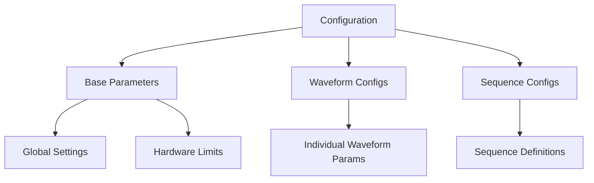
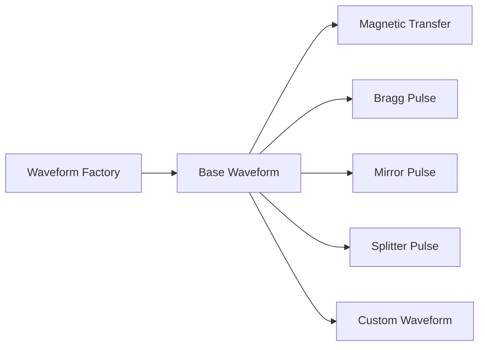
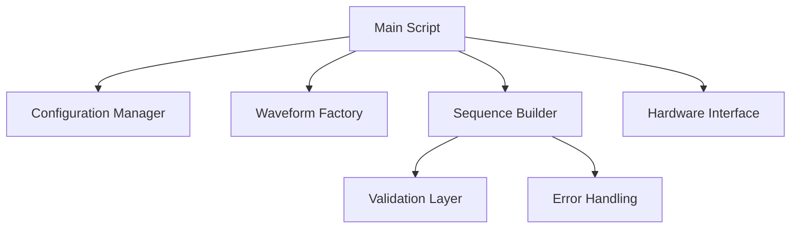

# Waveform Generator Improvement Plan

## Current Issues
- Waveform configurations are hardcoded in the main file
- Waveform generation logic is tightly coupled
- No clear abstraction for different waveform types
- Difficult to add new waveform patterns
- Parameters for similar waveforms are duplicated

## Proposed Architecture

### 1. Configuration Management System


- Create `config` directory for different configuration files
- Implement YAML/JSON based configuration for waveform parameters
- Add version control for configurations
- Create separate files for different waveform types

### 2. Waveform Factory Pattern


Key Components:
- Base waveform class with common properties/methods
- Derived classes for each waveform type
- Factory class to instantiate waveform objects
- Validation methods for each waveform type

### 3. Code Structure


Directory Structure:
```
waveform-generator/
├── src/
│   ├── WaveformTypes/
│   │   ├── BaseWaveform.m
│   │   ├── MagneticTransfer.m
│   │   ├── BraggPulse.m
│   │   ├── MirrorPulse.m
│   │   └── SplitterPulse.m
│   ├── Config/
│   │   ├── ConfigManager.m
│   │   └── ValidationRules.m
│   ├── Builders/
│   │   ├── SequenceBuilder.m
│   │   └── WaveformFactory.m
│   ├── Utils/
│   │   ├── WaveformUtils.m
│   │   └── ValidationUtils.m
│   └── Hardware/
│       └── DeviceInterface.m
├── config/
│   ├── base_config.yml
│   ├── waveforms/
│   │   ├── magnetic_transfer.yml
│   │   ├── bragg_pulse.yml
│   │   └── mirror_pulse.yml
│   └── sequences/
│       └── default_sequences.yml
└── tests/
    ├── unit/
    └── integration/
```

## Implementation Steps

1. **Phase 1: Configuration System**
   - Set up configuration file structure
   - Create ConfigManager class
   - Implement parameter validation
   - Add configuration versioning

2. **Phase 2: Waveform Factory**
   - Create base waveform class
   - Implement individual waveform types
   - Build factory class
   - Add waveform validation

3. **Phase 3: Sequence Builder**
   - Create sequence builder class
   - Implement sequence validation
   - Add pre/post processing hooks
   - Include error handling

4. **Phase 4: Code Migration**
   - Move existing code to new structure
   - Create utility functions
   - Implement hardware interface
   - Add logging and error reporting

5. **Phase 5: Testing & Documentation**
   - Write unit tests
   - Create integration tests
   - Document API and usage
   - Create example configurations

## Benefits

1. **Extensibility**
   - Easy addition of new waveform types
   - Plug-and-play sequence components
   - Configurable without code changes

2. **Maintainability**
   - Clear separation of concerns
   - Consistent validation
   - Centralized configuration

3. **Reliability**
   - Comprehensive error handling
   - Parameter validation
   - Automated testing

4. **Usability**
   - Simple configuration format
   - Clear documentation
   - Example configurations